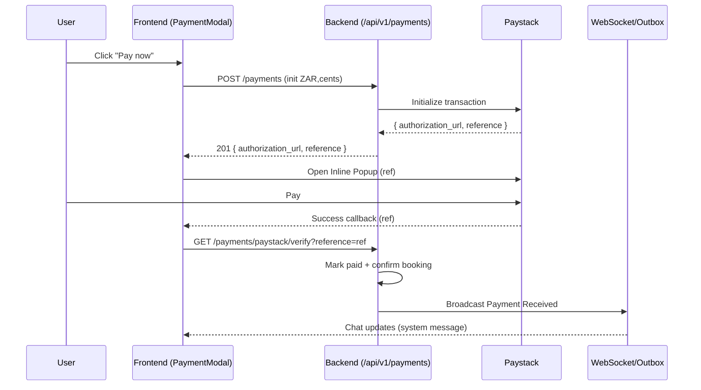

# Payments — How It Works (Baby‑Simple Guide)

This guide explains the payment flow in plain language, lists the key files, and shows a simple diagram so anyone can navigate and debug.

## One‑Line Story

Click “Pay now” → Paystack popup opens → you pay → our app verifies or receives a webhook → booking flips to paid/confirmed → chat shows “Payment received — order #REF”.

## Words We Use

- reference (aka payment_id): The Paystack ID for this charge.
- webhook: Paystack calls our server to say “paid”.
- verify: The browser asks our server to check with Paystack if “paid”.

## Frontend Flow

1) A screen triggers the PaymentModal (“Pay now”).
2) PaymentModal calls our backend to initialize the payment and get a `reference`.
3) PaymentModal opens the Paystack popup (inline) with your email and ZAR (amount in cents).
4) After success, PaymentModal verifies with our backend (polls `.../payments/paystack/verify?reference=REF`).
5) The UI updates; the chat thread shows “Payment received — order #REF”.

## Backend Flow

1) Init: `POST /api/v1/payments` (ZAR, amount×100) to Paystack; store `reference` on the Booking.
2) Verify: `GET /api/v1/payments/paystack/verify?reference=REF` confirms success and marks the booking paid.
3) Webhook (optional but recommended): Paystack POSTs to `/api/v1/payments/paystack/webhook` so the server can finish even if the user closes the tab.
4) After success, the server broadcasts a system message: “Payment received — order #REF”.

## Diagram (Sequence)

## Files (Where Everything Lives)

Frontend
- Payment modal (inline only): `frontend/src/components/booking/PaymentModal.tsx`
- Hook wrapper used by screens: `frontend/src/hooks/usePaymentModal.tsx`
- Chat (opens pay modal from details panel): `frontend/src/components/chat/MessageThreadWrapper.tsx`
- Booking summary “Reserve now” button: `frontend/src/components/chat/BookingSummaryCard.tsx`
- Client bookings page (Pay now buttons): `frontend/src/app/dashboard/client/bookings/page.tsx`
- Client booking details (uses modal directly): `frontend/src/app/dashboard/client/bookings/[id]/page.tsx`
- Paystack inline helper (loads popup script): `frontend/src/utils/paystackClient.ts`
- API client method for init: `frontend/src/lib/api.ts` (createPayment)

Frontend Tests (payments)
- PaymentModal inline tests: `frontend/src/booking/tests/payment/PaymentModal.inline.test.tsx`
- MessageThread forwarding test: `frontend/src/components/chat/__tests__/MessageThreadWrapper.payments.test.tsx`
- Client bookings forwarding test: `frontend/src/app/dashboard/client/bookings/__tests__/ClientBookings.payments.test.tsx`

Backend
- Payments API (init/verify/webhook/receipt): `backend/app/api/api_payment.py`
- App routes include payments under `/api/v1/payments`: `backend/app/main.py`
- Settings (keys, currency): `backend/app/core/config.py` (DEFAULT_CURRENCY, PAYSTACK_SECRET_KEY)

## Important Settings

- Currency is ZAR everywhere.
- Amounts are in cents (value × 100) for Paystack.
- Inline popup requires a valid customer email.
- Webhook URL (recommended): `https://api.booka.co.za/api/v1/payments/paystack/webhook`
- Keys must be from your South Africa Paystack account (test vs live to match the environment):
  - Frontend: `NEXT_PUBLIC_PAYSTACK_PUBLIC_KEY`
  - Backend: `PAYSTACK_SECRET_KEY`

## Troubleshooting

- Popup shows “Currency not supported by merchant” → keys/merchant not ZAR or popup currency mismatch.
- Popup doesn’t open → allow popups for your site; ensure `window.PaystackPop` exists (inline script loaded).
- “Could not start payment…” → missing/invalid email or a failed init; ensure you’re logged in as a client with a valid email.
- Paid but UI didn’t update → verify endpoint or webhook didn’t run; check network logs, try `/payments/paystack/verify?reference=REF` while logged in.

