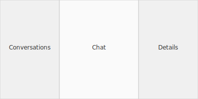
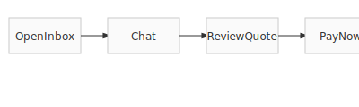

# Inbox Page Overview

Clients and artists communicate through the **Inbox** page.

## UX Flow

1. Conversation list shows all booking requests.  
   Unread threads display a red dot and are sorted by `last_message_timestamp`.
2. Selecting a conversation opens the chat area. Artists compose quotes
   using an inline form directly in the thread. Quotes then render as
   full-width cards showing booking details, an itemized cost breakdown,
   and **Accept**/**Decline** actions. Message history now queues outgoing
   messages while offline and defers image previews until tapped.
3. **Show Details** toggles a side panel with booking information and quick
   links for deposit payments and calendar events.

Notifications for new messages link directly to the relevant conversation.
System messages guide users when a booking request is created or a quote
is ready. These messages can include an `action` field such as
`review_quote` that tells the frontend to display a matching
call-to-action button in the thread.

Typing indicators are batched so multiple participants appear in a single
"is typing" notice.

> **Note:** The backend automatically adds the `action` column to the
> `messages` table if it's missing, ensuring upgrades from older
> deployments don't fail with missing-column errors.

The conversation list merges booking requests created by the user with
those where they are the artist. Non-artist users only fetch their client
requests to avoid API errors.

For the API fields used for sorting and previews, see the bullet about
`last_message_content` and `last_message_timestamp` in the
[README](../README.md).
